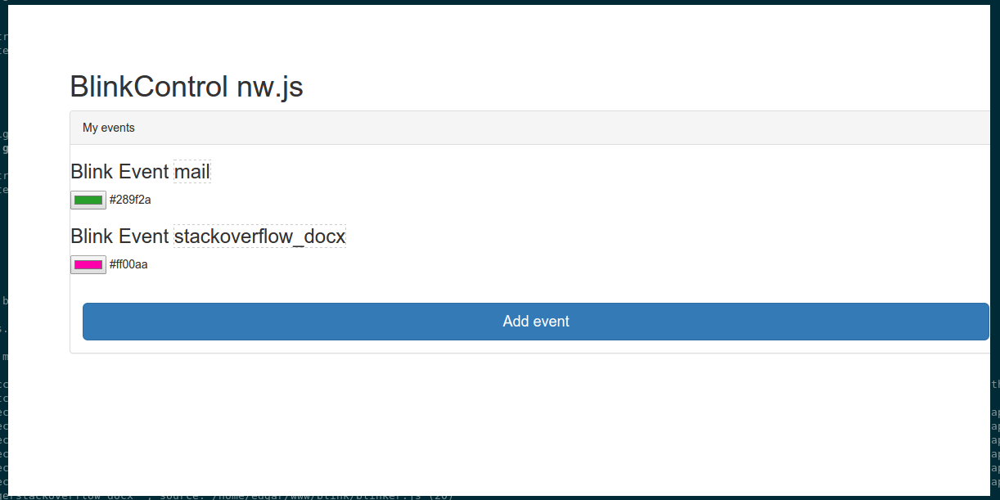

# Demo of Blink1Control in nw.js

This is just a simple demo of a blink1control app, it doesn't work completely as expected.

Screenshot:

It now does:

 * manage blink events (you can choose a color and an event name)
 * fetch data from ifttt (it will automatically run the blink event that has the same name as the iftt event)

It is completely cross platform (Win/OsX/Unix), and uses nw.js and riot.js

## Installation

Run:

    npm install
    bower install
    wget https://raw.githubusercontent.com/RobertWHurst/KeyboardJS/master/keyboard.js
